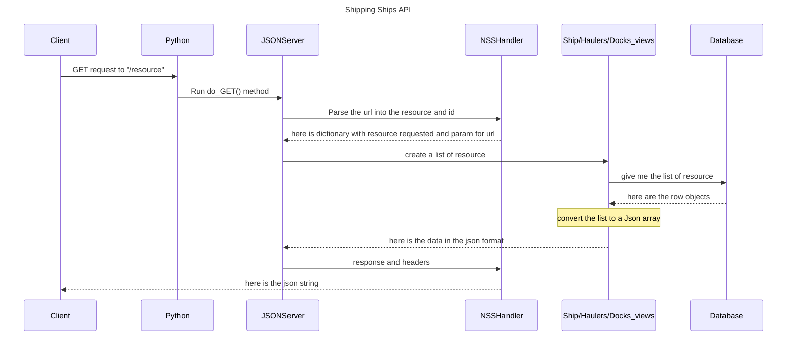

```mermaid
sequenceDiagram
     title Shipping Ships API

    participant Client
    participant Python
    participant JSONServer
    participant NSSHandler
    participant Ship/Haulers/Docks_views
    participant Database
    
    
  
    Client->>Python:GET request to "/resource"
    Python->>JSONServer:Run do_GET() method
    JSONServer->>NSSHandler: Parse the url into the resource and id
    NSSHandler-->>JSONServer: here is dictionary with resource requested and param for url
    JSONServer->>Ship/Haulers/Docks_views: create a list of resource
    Ship/Haulers/Docks_views->>Database: give me the list of resource
    Database-->>Ship/Haulers/Docks_views: here are the row objects
note over Ship/Haulers/Docks_views:convert the list to a Json array
    Ship/Haulers/Docks_views-->>JSONServer: here is the data in the json format 
JSONServer->>NSSHandler: response and headers
NSSHandler-->>Client: here is the json string
    
    

    

```